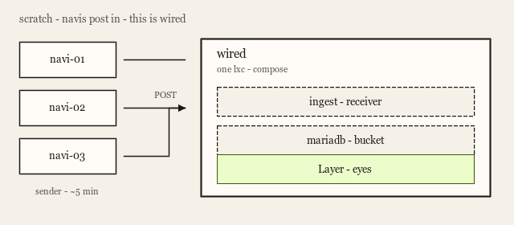

# wired first picture

scratchpad. not a spec. this is how i think it, first principles, our words.

this is wired.

## the ancient shape

server monitoring.

- one central host running our app
- 2 choices: the centre reaches out via ssh, or the remotes post in to the centre (agentless / agent based)
- app interprets and displays the data on a dashboard or table etc

phenomenally basic. that is the point. that is honestly how a very old monitoring box used to work.

we picked **post in**. remotes talk to the centre. not a jump host ssh'ing out.

## this is wired

we'll start with building the wired server. one lxc with 3 main services running off it:

- **ingest** - custom receiver
- **mariadb** - a bucket to put the ingested data in
- **grafana** - our eyes (this is Layer)

those three are compose processes inside the lxc. already in the repo. not a from-scratch rebuild of the box.

this is wired.

## navis

we will build some lxcs as demo, called navis. each navi runs a sender we write (a simple systemd unit running a python script likely). they can check in every 5 mins etc.

now we have 3 navis running a sender process, configured to send data via rest api, to the wired server.

sender / extra navi cts are still to build. today the stand-in is `./scripts/post-sample.sh` from a keyboard.

## the path

when data is received by wired ingest, it writes to mariadb.

we then read from that database using grafana, aka **Layer**.

Layer is the UX. this is where we beautifully present the work so the value actually shows.

## first steps. this is where we begin.

1. wired up. post. see a row.
2. sender under systemd.
3. navi-01, navi-02, navi-03 posting.
4. grow Layer until you'd leave it open.

stick here. iterate. if we do the aws component before we've actually designed this, i won't learn it properly. aws is the same wired, rented. later.
